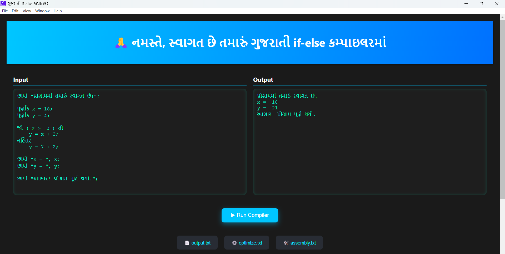
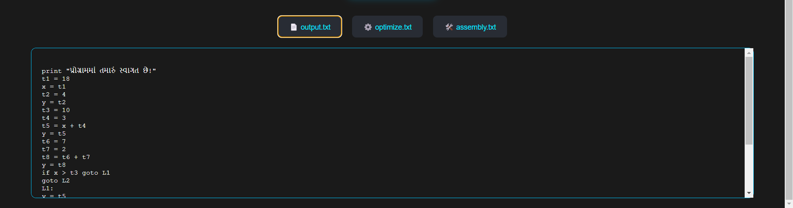

# Gujarati If-Else (જો-નહિંતર) Compiler

## 👨‍💻 Author
**Name**: Kaushal Ramoliya 

---

## 📘 Project Description
This project implements a simple compiler for a subset of the Gujarati language focusing on if-else statements. It processes input programs written in Gujarati, generates intermediate three-address code, optimizes it, produces assembly code, and finally interprets and executes it.

---

## ✨ Features
- 🔍 Lexical Analysis using **Flex** (`lex.l`)
- 📐 Syntax Analysis using **Bison** (`yacc.y`)
- 🛠 Intermediate Code Generation (`codegen.c`)
- ⚙️ Code Optimization (e.g., constant folding)
- 🧾 Assembly Code Generation (`assembly.txt`)
- 🐍 Interpreter in **Python** (`interpreter.py`)

---


## UI Screenshots

Below are screenshots of the project UI:

<p align="center">
  
  
  
</p>

---

## ⚙️ Requirements
- `flex` (version ≥ 2.6)  
- `bison` (version ≥ 3.0)  
- `gcc` (version ≥ 9.0)  
- `python3` (version ≥ 3.6)

---

## 🚀 How to Build & Run

### 1. Generate parser and lexer
```bash
bison -d yacc.y      # produces yacc.tab.c and yacc.tab.h
flex lex.l           # produces lex.yy.c
``` 

### 2. Compile the parser and lexer
```bash
gcc lex.yy.c yacc.tab.c
```

### 3. Run the compiler
```bash
./a.exe               #< input.txt > output.txt
```

### 4. Generate assembly code
```bash
gcc codegen.c
./a.exe              # reads optimize.txt, generates assembly.txt
```

### 5. Interpret and execute
```bash
python interpreter.py
```

---


## 📝 Sample Input (input.txt)
```bash
છાપો "પ્રોગ્રામમાં તમારું સ્વાગત છે!";

પૂર્ણાંક x = 18;
પૂર્ણાંક y = 4;

જો ( x > 10 ) તો
    y = x + 3;
નહિંતર
    y = 7 + 2;

છાપો "x = ", x;
છાપો "y = ", y;

છાપો "આભાર! પ્રોગ્રામ પૂર્ણ થયો.";
```

## 📤 Sample Output (final_output.txt)
```bash
પ્રોગ્રામમાં તમારું સ્વાગત છે!
x =  18
y =  21
આભાર! પ્રોગ્રામ પૂર્ણ થયો.
```

## 🧮 Three-Address Code (output.txt)
```bash
print "પ્રોગ્રામમાં તમારું સ્વાગત છે!"
t1 = 18
x = t1
t2 = 4
y = t2
t3 = 10
t4 = 3
t5 = x + t4
y = t5
t6 = 7
t7 = 2
t8 = t6 + t7
y = t8
if x > t3 goto L1
goto L2
L1:
y = t5
goto L3
L2:
y = t8
L3:
print "x = ", x
print "y = ", y
print "આભાર! પ્રોગ્રામ પૂર્ણ થયો."
```

## ⚡ Optimized Code (optimize.txt)
```bash
print "પ્રોગ્રામમાં તમારું સ્વાગત છે!"
t1 = 18
x = t1
t2 = 4
y = t2
t3 = 10
t4 = 3
t5 = x + 3
y = t5
t6 = 7
t7 = 2
t8 = 9
y = t8
if x > 10 goto L1
goto L2
L1:
y = t5
goto L3
L2:
y = t8
L3:
print "x = ", x
print "y = ", y
print "આભાર! પ્રોગ્રામ પૂર્ણ થયો."
```

## 🖥 Assembly Code (assembly.txt)
```bash
MOV R1, 18
MOV R2, R1
MOV R3, 4
MOV R4, R3
MOV R5, 10
MOV R6, 3
MOV R7, 3
ADD R8, R2, R7
MOV R9, R8
MOV R10, 7
MOV R11, 2
MOV R12, 9
MOV R13, R12
CMP R2, 10
JG L1
JMP L2
L1:
MOV R14, R8
JMP L3
L2:
MOV R15, R12
L3:
```


